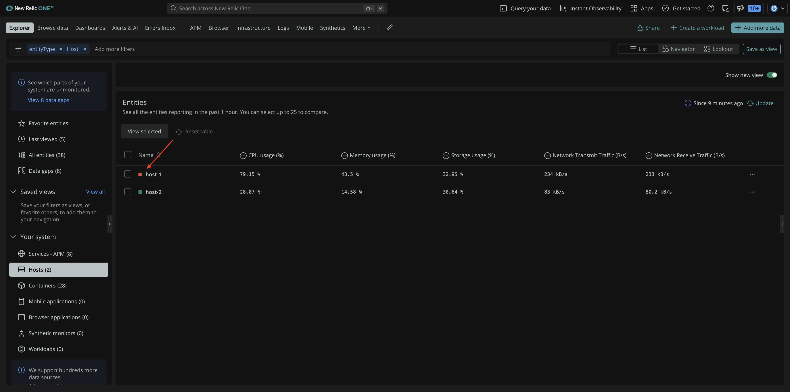
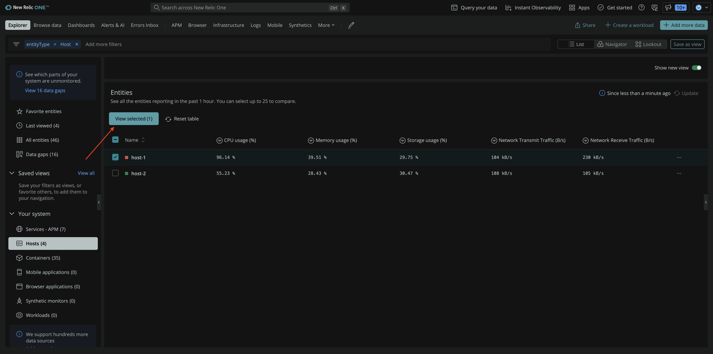
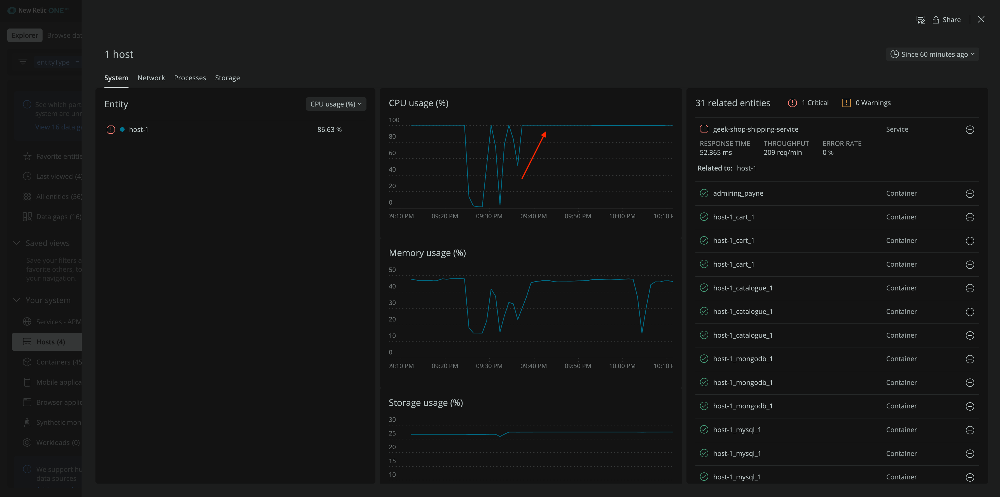
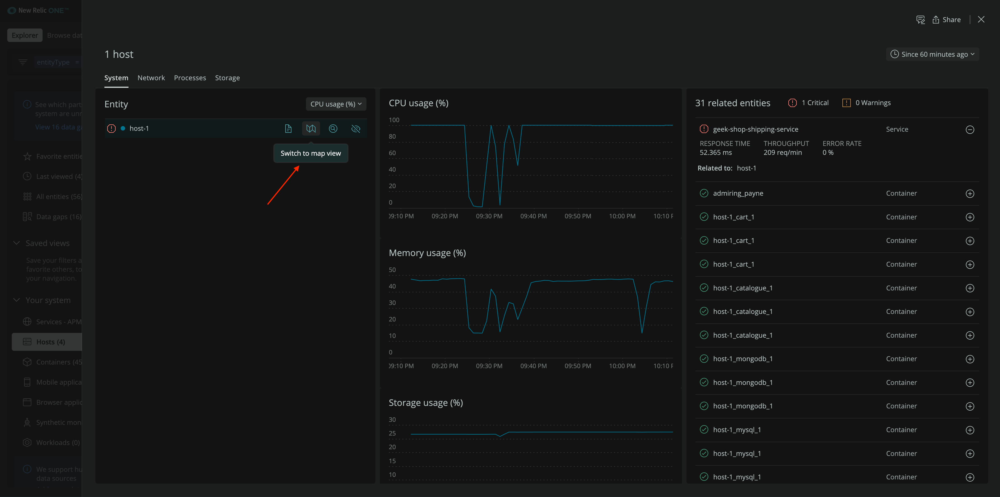
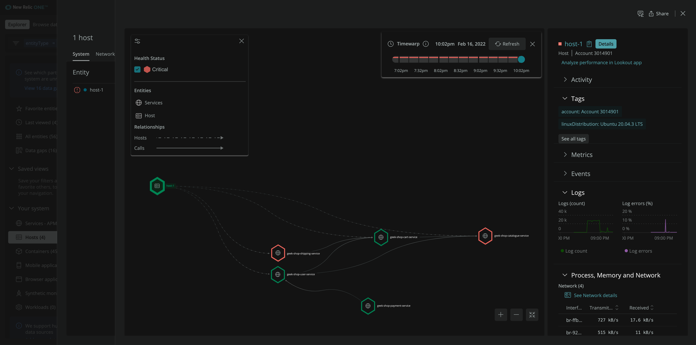

You've instrumented your hosts with New Relic infrastructure agent to monitor their performance. At 2AM, you get paged that one of your critical alerts is firing. Being tired, you want to identify the depleted resources as soon as possible and isolate the system responsibele for the issue. This allows you to reduce your search perimeter when mitigating the situation. You also want to confirm the blast radius to prioritize if the situation should be mitigated urgently.

- Note: Since we're sending mock traffic to the site using loader service, it takes sometime for service to spin up and start sending traffic. Moreover, the Golden Signals' High CPU has a 5 minute time before it fires the alert. If you don't see your host alerting just yet, sit back and allow it sometime.

## Identify depleted resources

Go to [New Relic One](https://one.newrelic.com) and select **Hosts** from left hand menu.
Here, you see a list of your hosts. You notice that host-1 is marked red and it also shows a high CPU usage.

This indicate that something is wrong with host-1. But you need to further investigate the problem and confirm if high CPU usage is the problem.

Select **host-1** and click **View selected**.

Next page shows you a detail view of host-1 with **CPU usage**, **Memory usage**, **Storage usage** as well as **related entities**.

- Note: New Relic infrastructure agent automatically discovers the related entities and maps their relationship. If you don't see any **related entities**, allow infrastructure agent some time to discover them.

Observe the **CPU usage** graph.

This graph indicate that your CPU usage is almost reaching 100% for past sometime. This confirms that indeed high CPU utilization issue is occuring.

## Determine the blast radius

Now that you've confirmed that a part of your infrastructure is depleted, the next step is to determine the blast radius so you could prioritize mitigating the issue.

To determine the blast radius, you need to know what entities are connected to this part of the infrastructure. This is important since it can help you troubleshoot quickly. You can use the automap to display the connected entities for this host.

On the host detail page, select **Switch to map view**.

This opens up automap and display all the connected entities to this host.

You see that this host is hosting your user, shipping, cart and catalogue service of which 2 are already firing critical alerts. These services are cruicial for your site and you suspect that thousands of your users will be impacted due to this degradation.

Now that you have isolated the depleted resources and the blast radius seems huge, it is important to discover the root cause of the issue so you could quickly mitigate the situation and ensure a smooth experience for your customers.
