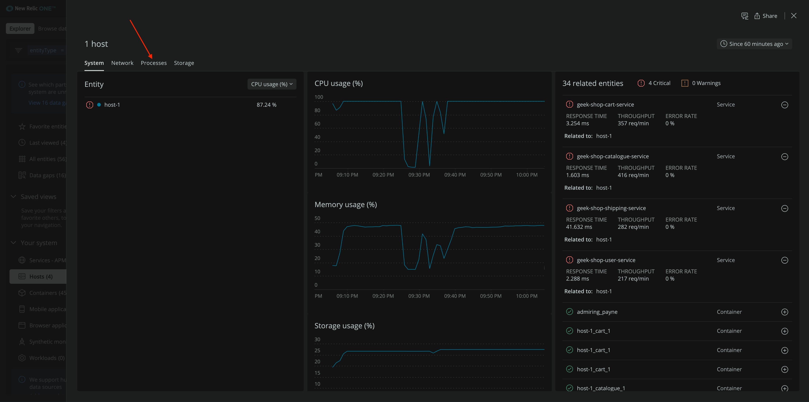
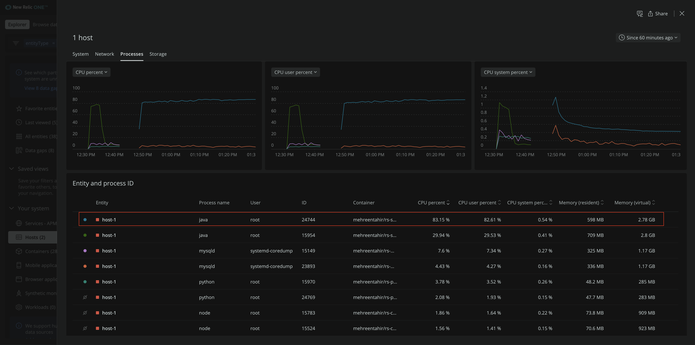
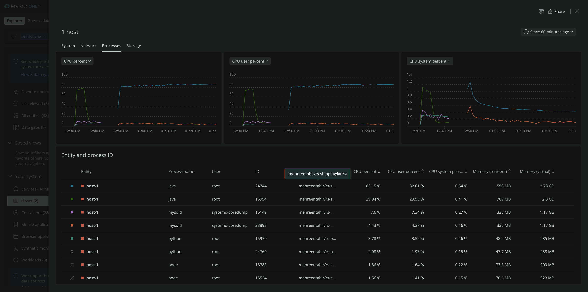

You instrumented your hosts with New Relic infrastructure agent to monitor your infrastructure for any degradation. That was helpful since you identified the depleted resources in time. You also determined that the blast radius for this degradation is huge and if not mitigated immediately, then it can impact thousands of your users. However, you stillneed to discover root cause of system degradation before you could mitigate it.

# Discover root cause of system degradation

You discovered that the CPU usage of your host is very high. However, everything was fine when you went to bed. the only possible explanantion is that some process started consuming too much resources due to some bug. To validate your theory, you look through the processes running on your host.

From the host detail page, switch your view from **System** to **Processes**.

Here, you see **Entity and process ID** along with their **Container**, **CPU percent** and other. These processes are sorted in the order of CPU percent. Notice that the first process is using 83.15% of CPU.

That's rather odd because even the other java process is consuming very less resources.
Hover over the **Container** column to see what container is causing the problem.

That solves the mystery. shipping container with the latest tag is consuming high CPU percent. It is reflecting on your host and also affecting other hosted services. Now that you've discovered the root cause of high CPU utilization, you can pass on this information to the team responsible for shipping service and go back to sleep.

## Summary
In this lab, you instrument your hosts with New Relic Infrastructure agent to monitor your infrastructure for any degradation. You discover any degradation in your system and try to mitigate the situation before it disrupts your services.

## Homework
Now that you know how to instrument your infrastructure with New Relic, here are some resources you can utilize to familiarize yourself even more with New Relic infrastructure.
- [Infrastructure monitoring](https://newrelic.com/blog/nerdlog/infrastructure-monitoring-in-preview)
- [Get started with infrastructure monitoring] (https://docs.newrelic.com/docs/infrastructure/infrastructure-monitoring/get-started/get-started-infrastructure-monitoring/)
- [New infrastructure hosts UI](https://docs.newrelic.com/docs/infrastructure/infrastructure-ui-pages/infrastructure-ui-entities)